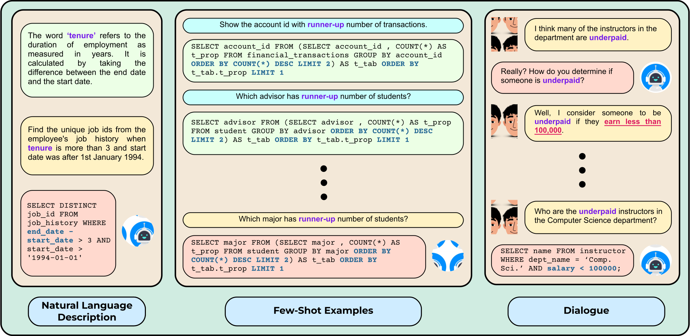

<h2 align="center">
  MAGNIFICo
</h2>
<h5 align="center">Evaluating the In-Context Learning Ability of Large Language Models to Generalize to Novel Interpretations</h5>

<p align="center">
  <a href="https://2023.emnlp.org/"></a>
  <a href="https://aclanthology.org/2023.emnlp-main.134/"></a>
  <a href="https://github.com/McGill-NLP/MAGNIFICo/blob/main/LICENSE">
    
  </a>
</p>

<p style="text-align: justify;">
Humans possess a remarkable ability to assign novel interpretations to linguistic expressions, enabling them to learn new words and understand community-specific connotations. However, Large Language Models (LLMs) have a knowledge cutoff and are costly to finetune repeatedly. Therefore, it is crucial for LLMs to learn novel interpretations in-context. In this paper, we systematically analyse the ability of LLMs to acquire novel interpretations using in-context learning. To facilitate our study, we introduce MAGNIFICo, an evaluation suite implemented within a text-to-SQL semantic parsing framework that incorporates diverse tokens and prompt settings to simulate real-world complexity. Experimental results on MAGNIFICo demonstrate that LLMs exhibit a surprisingly robust capacity for comprehending novel interpretations from natural language descriptions as well as from discussions within long conversations. Nevertheless, our findings also highlight the need for further improvements, particularly when interpreting unfamiliar words or when composing multiple novel interpretations simultaneously in the same example. Additionally, our analysis uncovers the semantic predispositions in LLMs and reveals the impact of recency bias for information presented in long contexts.
</p>
<h2 align="center">
  
</h2>


#### Dependencies

- compatible with python 3
- dependencies can be installed using `MAGNIFICo/requirements.txt`

#### Setup

Install VirtualEnv using the following (optional):

```shell
$ [sudo] pip install virtualenv
```

Create and activate your virtual environment (optional):

```shell
$ virtualenv -p python3 venv
$ source venv/bin/activate
```

Install all the required packages:

at `MAGNIFICo/:`

```shell
$ pip install -r requirements.txt
```

#### Download Spider Database

Download the spider database for evaluation. You can find it online [here](https://drive.google.com/file/d/1Gb4ezwuYWi38maCBZAAyxet2JVCpqDQW/view?usp=sharing). Place the extracted `database` folder inside `MAGNIFICo/spider/`.

#### Created Data

All the data we created can be found in `MAGNIFICo/magnifico_data`

#### Usage

The set of command line arguments available can be seen in the respective `main.py` file. Here, we illustrate running the experiments for GPT-4 and LLaMA-2 for specific experimental settings. Follow the same methodology for running any experiment over any model.


##### Running GPT-4 for evaluating the 'plausible and nonsense form' settings with 'natural language descriptions' prompt type across all interpretations:

At `MAGNIFICo:`

```shell
$	python main.py -model_type chat -model gpt-4 -batch_size 1 -settings plausible,nonsense -prompt_types instr -instr_positions end -interpretations all
```


##### Running LLaMA-2-70B for evaluating the multiple novel interpretations setting:

Set up and install HuggingFace's [Text-Generation-Inference](https://github.com/huggingface/text-generation-inference) locally.

Open a server in one terminal window:

```shell
$ CUDA_VISIBLE_DEVICES=0,1 HUGGING_FACE_HUB_TOKEN=<hf_token> text-generation-launcher --model-id meta-llama/Llama-2-70b-hf --huggingface-hub-cache <cache_dir> --num-shard 2 --max-input-length 3500 --max-total-tokens 4096 --master-port 29500 --port 8080
```

Then at `MAGNIFICo:`

```shell
$	python main.py -model_type tgi -model llama-2-70b -batch_size 1 -combi
```

#### Citation

If you use our data or code, please cite our work:

```
@inproceedings{patel-etal-2023-magnifico,
    title = "{MAGNIFIC}o: Evaluating the In-Context Learning Ability of Large Language Models to Generalize to Novel Interpretations",
    author = "Patel, Arkil  and
      Bhattamishra, Satwik  and
      Reddy, Siva  and
      Bahdanau, Dzmitry",
    editor = "Bouamor, Houda  and
      Pino, Juan  and
      Bali, Kalika",
    booktitle = "Proceedings of the 2023 Conference on Empirical Methods in Natural Language Processing",
    month = dec,
    year = "2023",
    address = "Singapore",
    publisher = "Association for Computational Linguistics",
    url = "https://aclanthology.org/2023.emnlp-main.134",
    doi = "10.18653/v1/2023.emnlp-main.134",
    pages = "2167--2189",
    abstract = "Humans possess a remarkable ability to assign novel interpretations to linguistic expressions, enabling them to learn new words and understand community-specific connotations. However, Large Language Models (LLMs) have a knowledge cutoff and are costly to finetune repeatedly. Therefore, it is crucial for LLMs to learn novel interpretations in-context. In this paper, we systematically analyse the ability of LLMs to acquire novel interpretations using in-context learning. To facilitate our study, we introduce MAGNIFICo, an evaluation suite implemented within a text-to-SQL semantic parsing framework that incorporates diverse tokens and prompt settings to simulate real-world complexity. Experimental results on MAGNIFICo demonstrate that LLMs exhibit a surprisingly robust capacity for comprehending novel interpretations from natural language descriptions as well as from discussions within long conversations. Nevertheless, our findings also highlight the need for further improvements, particularly when interpreting unfamiliar words or when composing multiple novel interpretations simultaneously in the same example. Additionally, our analysis uncovers the semantic predispositions in LLMs and reveals the impact of recency bias for information presented in long contexts.",
}
```

For any clarification, comments, or suggestions please contact [Arkil](http://arkilpatel.github.io/).
